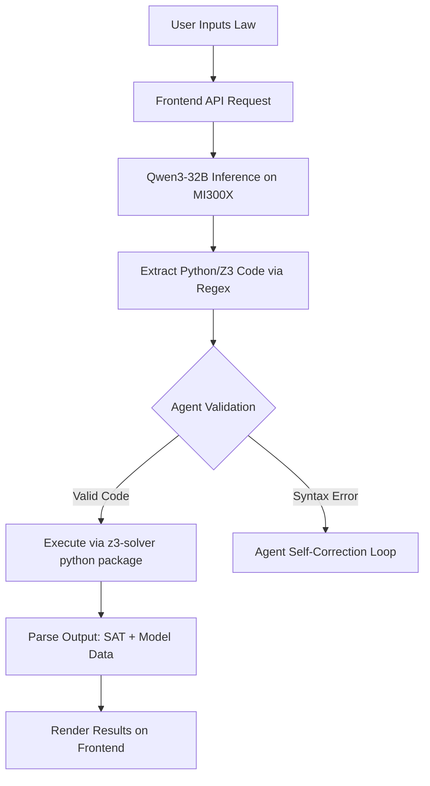

# JurisSim: Architecture & UI/UX Specification

This document serves as the comprehensive blueprint for building the JurisSim frontend application and backend agentic workflow. It is designed to act as the official technical documentation for the AMD Developer Hackathon submission.

> [!IMPORTANT]
> The primary objective of this application is to visually demonstrate the leap from **generative text** to **mathematical proof**. The UI must make the Z3 formal verification process feel tangible, interactive, and undeniable to the judges.

## 1. Product Vision & Architecture

JurisSim operates as a multi-stage **Neuro-Symbolic Agent**. The architecture is divided into three core layers:

1.  **The Interface (Frontend):** A React-based or Gradio web application hosted on Hugging Face Spaces.
2.  **The LLM Engine (Inference):** The fine-tuned Qwen3-32B model, served via vLLM on AMD ROCm infrastructure, tasked with parsing legal text and generating Z3 solver code.
3.  **The Verifier (Agentic Backend):** A secure Python sandbox that intercepts the model's output, executes the Z3 logic, and parses the mathematical proof (SAT/UNSAT) back to the user.

---

## 2. Frontend Design (UI/UX Specification)

The interface must feel like a premium, enterprise-grade compliance dashboard—not a standard chat window. 

### A. Color Palette & Typography
*   **Theme:** Sleek Dark Mode (Glassmorphism style).
*   **Primary Accent:** AMD Red (`#ED1C24`) subtly used for action buttons and critical highlights, shifting to Neon Blue (`#00A3E0`) for active processing states.
*   **Background:** Deep Midnight (`#0B0F19`) with translucent, blurred glass panels (`rgba(255, 255, 255, 0.05)`).
*   **Typography:** *Inter* or *Outfit* (Google Fonts) for clean, modern readability. Monospace (*Fira Code*) exclusively for Z3 code blocks.

### B. Layout Structure
A three-panel dashboard design maximizing screen real-estate to show the full pipeline simultaneously.

#### Panel 1: The Input Matrix (Left Column)
*   **Purpose:** Where the user inputs the legislation or contract.
*   **Elements:**
    *   Large, styled `<textarea>` with line numbers.
    *   **"Load Example" dropdown:** Pre-loaded adversarial texts (e.g., *Tax Code Section 4A*, *Liability Clause 12*).
    *   **Primary CTA Button:** "Audit Legislation" with a sweeping micro-animation on hover.

#### Panel 2: The Neural Translation (Center Column)
*   **Purpose:** Shows the model "thinking" and generating the Z3 code in real-time.
*   **Elements:**
    *   A syntax-highlighted code editor block (read-only).
    *   As the LLM streams output, the code block fills up. 
    *   **Visual Cue:** A subtle pulsing glow around the panel while the AMD GPU is processing.

#### Panel 3: The Verification Engine (Right Column)
*   **Purpose:** The agentic execution layer. Where the math happens.
*   **Elements:**
    *   A terminal-like window simulating the Z3 execution environment.
    *   **Output States:**
        *   🔴 **LOOPHOLE FOUND (SAT):** The panel flashes with a warning border. The specific counter-example (the exploit) is displayed in human-readable text.
        *   🟢 **SECURE (UNSAT):** The panel glows green, confirming the logic holds under all conditions.

---

## 3. Integration Pipeline (Agentic Workflow)

To satisfy **Track 1 (AI Agents)**, we cannot just display the text. We must build a workflow script.

> [!TIP]
> The "Agent Self-Correction Loop" is a killer feature for the hackathon. If Z3 throws a Python syntax error, feed the error back into Qwen3-32B automatically (behind the scenes) and ask it to fix the code, *then* return the final result to the user.

---

## 4. Hackathon Submission Strategy

To maximize the judging criteria for the AMD Developer Hackathon:

### Open Questions & User Review Required

1.  **Framework Choice:** Do you prefer we build this UI natively in **React (Next.js/Vite)** for a highly custom, premium aesthetic, or use **Gradio/Streamlit** for rapid deployment directly into a Hugging Face Space? *(Next.js looks significantly better and wins design points, but Gradio is faster to wire up to Python).*
2.  **Hosting the Inference:** Since your MI300X instance is where the model lives, we need to decide if we will expose a secure API endpoint from your server (using FastAPI or vLLM) that the frontend can call, or if we are going to attempt to push the massive 32B model to run entirely on Hugging Face infrastructure. *(Serving it from your AMD instance is recommended to show off the hardware).*

Please review the open questions above. Once you confirm the framework choice, I will immediately begin constructing the frontend application!
