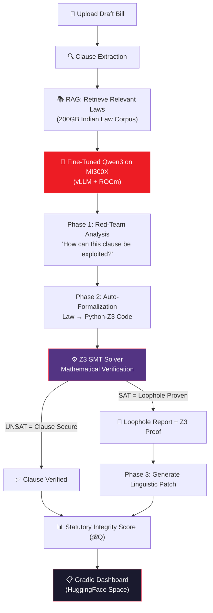
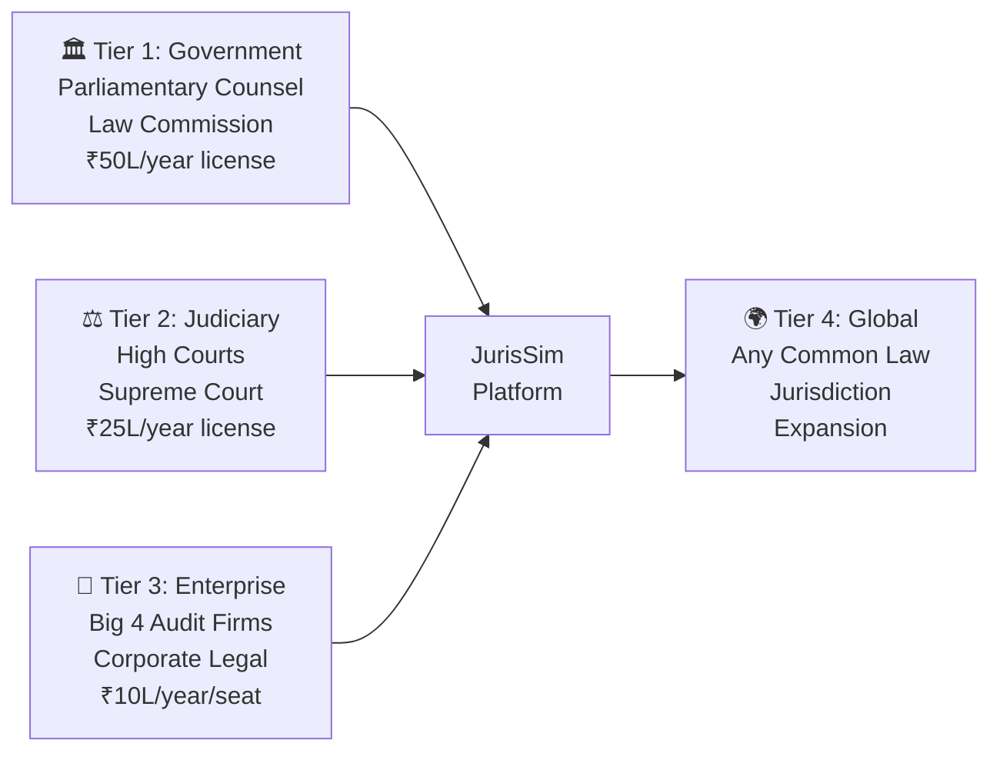

# JurisSim — Winning the AMD Developer Hackathon

## Track: ⚡ Track 2: Fine-Tuning on AMD GPUs

**Why Track 2**: Legal domain is *explicitly listed* as a target ("Healthcare, Finance, **Legal**, or Code"). Your RAG+fine-tuning combo is exactly what this track rewards. The fine-tuning differentiates you from Track 1 "just another RAG" projects.

**Dual-Track Entry**: Also enter 🚢 Ship It + Build in Public for the dedicated prize pool.

---

## Your Intuition Was Right: RAG + Fine-Tuning Is The Play

You're correct on both points:

1. **200GB RAG won't slow anything down** — embeddings are stored as vectors (~2-4GB index for 200GB of text). Retrieval is millisecond-speed lookups. The raw text stays on disk. The MI300X has 192GB HBM3, so the vector index fits entirely in GPU memory.

2. **RAG + Fine-Tuning is the optimal architecture**:
   - **Fine-tuning** = teaches the model the **SKILL** (how to formalize law → Z3, how to think adversarially)
   - **RAG** = provides the **KNOWLEDGE** (specific laws, precedents, definitions at query time)
   - Without fine-tuning: the model can't reliably produce valid Z3 code
   - Without RAG: the model hallucinates specific legal provisions

This is a textbook "neuro-symbolic" design that judges will recognize as sophisticated.

---

## The AMD-Native Architecture

### Tech Stack (100% AMD/ROCm)

| Component | Technology | AMD Alignment |
|:---|:---|:---|
| **Compute** | AMD Instinct MI300X (192GB HBM3) | AMD Developer Cloud |
| **Fine-Tuning** | PyTorch + PEFT (QLoRA) on ROCm | Track 2 requirement |
| **Serving** | vLLM on ROCm | AMD-optimized inference |
| **Model** | **Qwen3-14B** (or Qwen3-30B-A3B MoE) | Qwen partner challenge ✅ |
| **Logic Engine** | Z3 SMT Solver | Platform-agnostic |
| **Vector DB** | ChromaDB / FAISS | Stores 200GB corpus embeddings |
| **Embeddings** | BAAI/bge-large-en-v1.5 | Runs on AMD GPU via PyTorch |
| **UI** | Gradio → HuggingFace Space | HF prize eligible ✅ |

> [!IMPORTANT]
> **Model choice**: On MI300X you can run **Qwen3-14B in full precision** or **Qwen3-30B-A3B (MoE)** in 4-bit. The MoE model only activates 3B parameters per inference but has 30B total knowledge — perfect for legal reasoning with fast inference. Either works; 14B is safer for the timeline.

### System Flow



### Why This Architecture Wins

The key insight judges will see:

| Other Teams | JurisSim |
|:---|:---|
| LLM says "this might be a problem" | Z3 **mathematically proves** it's a problem |
| RAG only (Track 1 level) | RAG + Fine-Tuning (Track 2 level) |
| Generic model wrapper | Domain-specialized legal compiler |
| Text output only | Executable Z3 code + formal proof |

**Pitch line**: *"We don't guess loopholes — we mathematically prove them."*

---

## Fine-Tuning Strategy (The Track 2 Differentiator)

### What You're Fine-Tuning FOR

You are teaching the model a **skill**, not knowledge. The skill is **Auto-Formalization**: converting natural language legal clauses into executable Python-Z3 constraints.

### Dataset: ~2,000 Synthetic Pairs

| Field | Example |
|:---|:---|
| **system** | "You are a legal formalization engine. Convert the given Indian legal clause into Python-Z3 code that can be checked for satisfiability." |
| **instruction** | "Formalize: 'Every registered dealer shall pay tax on goods sold within the state at the rate prescribed.' Consider adversarial interpretations." |
| **response** | Python-Z3 code block with variables, constraints, and solver check |

Generate these pairs using a larger model (Qwen3-235B API or GPT-4) then fine-tune your 14B model to replicate the skill.

### Fine-Tuning Config (ROCm-Native)

```python
# QLoRA on AMD MI300X via ROCm
from peft import LoraConfig, get_peft_model, prepare_model_for_kbit_training
from transformers import AutoModelForCausalLM, BitsAndBytesConfig
import torch

# 4-bit quantization config
bnb_config = BitsAndBytesConfig(
    load_in_4bit=True,
    bnb_4bit_quant_type="nf4",
    bnb_4bit_compute_dtype=torch.bfloat16,
)

model = AutoModelForCausalLM.from_pretrained(
    "Qwen/Qwen3-14B",
    quantization_config=bnb_config,
    device_map="auto",  # Maps to MI300X via ROCm
)

lora_config = LoraConfig(
    r=64, lora_alpha=16, lora_dropout=0.1,
    target_modules=["q_proj", "k_proj", "v_proj", "o_proj"],
    task_type="CAUSAL_LM",
)
model = get_peft_model(prepare_model_for_kbit_training(model), lora_config)
# Train with HF Trainer — max_seq_length=8192 for long legal clauses
```

### Serving the Fine-Tuned Model

```bash
# vLLM on ROCm — serves the LoRA adapter on top of base model
docker pull rocm/vllm:latest
vllm serve Qwen/Qwen3-14B \
  --enable-lora \
  --lora-modules jurissim-lora=/path/to/adapter \
  --tensor-parallel-size 1 \
  --max-model-len 8192
```

---

## Business Value (Maximized)

### The Problem (With Real Numbers)

| Metric | Data |
|:---|:---|
| **India's judicial backlog** | **53 million** pending cases (2025) |
| **Judges per million people** | 21 (vs. recommended 50) |
| **Bills passed per year** | ~50 Central + 500+ State |
| **Post-enactment amendment cost** | Months of parliamentary time + judicial review |
| **Legal tech market (India, 2026)** | **$1.3–1.5 billion** and growing |
| **Legal tech startups in India** | ~1,000+ (but none do formal verification) |

### The "Hair on Fire" Problem

> India's courts follow the **Literal Rule** — if the text is clear, it must be followed, even if absurd. This means a single poorly-worded clause can create an exploitable loophole that takes **years** of litigation to close. JurisSim catches these **before enactment**.

### Revenue Model



| Segment | Target Customers | Pricing | Year 1 Revenue |
|:---|:---|:---|:---|
| **Government** | Parliament, Law Commission, 28 State Legislatures | ₹50L/year | ₹15 Cr |
| **Judiciary** | 25 High Courts, Supreme Court | ₹25L/year | ₹6.5 Cr |
| **Enterprise** | Big 4 firms, top 100 law firms, compliance teams | ₹10L/seat/year | ₹10 Cr |
| **Global** | UK, Australia, Canada (common law) | USD pricing | TBD |

**Total Addressable Market (TAM)**: India legal tech = $1.5B. JurisSim's niche (pre-enactment analysis) = ~$50M serviceable.

### Competitive Advantage

| Competitor | Approach | JurisSim Advantage |
|:---|:---|:---|
| **Manupatra / SCC Online** | Legal search/retrieval | We **analyze**, not just retrieve |
| **Harvey AI** | LLM-based legal assistant | We provide **mathematical proof**, not opinions |
| **Lucio / Jurisphere** | Indian legal AI | No formal verification layer |
| **Generic LLM wrappers** | Prompt engineering | Our fine-tuning + Z3 = zero hallucination guarantee |

**Moat**: The fine-tuned auto-formalization model + Z3 verification pipeline is extremely hard to replicate. No competitor has this.

---

## 5-Day Build Plan (May 6–10)

| Day | Focus | Deliverables | AMD Touchpoint |
|:---|:---|:---|:---|
| **Day 1 (May 6)** | AMD Cloud setup + model serving | Qwen3-14B running on MI300X via vLLM/ROCm | ✅ Cloud + ROCm |
| **Day 2 (May 7)** | Fine-tuning dataset + QLoRA training | 2K training pairs generated; LoRA adapter trained | ✅ Fine-tuning on MI300X |
| **Day 3 (May 8)** | RAG pipeline + Z3 engine | ChromaDB loaded; end-to-end clause→Z3 proof working | ✅ Inference on MI300X |
| **Day 4 (May 9)** | Gradio UI + HuggingFace Space | Working dashboard deployed as HF Space | ✅ AMD-powered backend |
| **Day 5 (May 10)** | Demo video + pitch + social posts | Submission-ready package | ✅ Build in Public posts |

### Day 1 Detail: AMD Cloud Setup

```bash
# 1. Spin up MI300X instance on AMD Developer Cloud
# 2. Pull the ROCm vLLM container
docker pull rocm/vllm:latest

# 3. Test Qwen3-14B inference
docker run --device /dev/kfd --device /dev/dri \
  -p 8000:8000 rocm/vllm:latest \
  vllm serve Qwen/Qwen3-14B --tensor-parallel-size 1

# 4. Verify with a test query
curl http://localhost:8000/v1/completions \
  -H "Content-Type: application/json" \
  -d '{"model": "Qwen/Qwen3-14B", "prompt": "Formalize this legal clause into Z3:", "max_tokens": 200}'
```

### Day 2 Detail: Fine-Tuning Pipeline

1. Use a large model (API) to generate 2,000 (legal clause → Z3 code) training pairs
2. Validate that each Z3 code block actually runs and produces `sat`/`unsat`
3. Run QLoRA training on MI300X (~2-3 hours for 2K examples)
4. Merge LoRA adapter and test inference quality

### Day 3 Detail: The Core Engine

```python
# Simplified pipeline pseudocode
def analyze_bill(bill_text: str) -> Report:
    # 1. Extract clauses
    clauses = llm_extract_clauses(bill_text)
    
    # 2. For each clause, retrieve relevant existing laws (RAG)
    for clause in clauses:
        context = rag_retrieve(clause, top_k=5)  # From 200GB corpus
        
        # 3. Red-team: find adversarial interpretations
        hypotheses = llm_red_team(clause, context)
        
        # 4. Auto-formalize each hypothesis to Z3
        for h in hypotheses:
            z3_code = llm_formalize(clause, h, context)  # Fine-tuned skill!
            
            # 5. Run Z3 solver
            result = execute_z3(z3_code)
            if result == "sat":
                # 6. Loophole confirmed! Generate patch
                patch = llm_generate_patch(clause, h, result)
                report.add_loophole(clause, h, z3_code, result, patch)
    
    # 7. Compute Statutory Integrity Score
    report.score = compute_integrity_score(report)
    return report
```

---

## Maximizing Each Judging Criterion

### 1. Application of Technology (25%)

| What To Demonstrate | How |
|:---|:---|
| AMD MI300X usage | Fine-tuning + inference on AMD Developer Cloud |
| ROCm integration | PyTorch ROCm backend, vLLM ROCm container |
| Qwen models | Qwen3-14B (partner challenge bonus) |
| vLLM serving | OpenAI-compatible API on ROCm |
| HuggingFace | Model + Space published to HF org |

**In your pitch**: Show a terminal screenshot of `rocm-smi` during fine-tuning. Show vLLM logs. Make the AMD stack visible.

### 2. Originality (25%)

| Unique Element | Why It's Novel |
|:---|:---|
| LLM + Z3 formal verification | No other legal AI does mathematical proofs |
| Auto-formalization (law → FOL → Z3) | Active research area you're implementing |
| Adversarial red-teaming of legislation | Offensive security mindset applied to law |
| Pre-enactment analysis | Preventive, not reactive |
| Statutory Integrity Score (𝓡Q) | Quantitative metric for law "airtightness" |

### 3. Business Value (25%)

Already covered above. Key numbers to memorize:
- **53M case backlog** → poorly drafted laws create more cases
- **$1.5B Indian legal tech market** → large and growing
- **Zero competitors** doing formal verification of legislation
- **Clear revenue model** with 3 tiers

### 4. Presentation (25%)

**Demo Video Structure** (3-5 min):
1. **(0:00-0:30)** Hook: "What if we could mathematically prove a law has a loophole?"
2. **(0:30-1:30)** Problem: India's Literal Rule, 53M case backlog, drafting errors
3. **(1:30-3:00)** Live Demo: Upload a bill → see loopholes flagged → Z3 proof → patch
4. **(3:00-4:00)** Tech: Show the AMD MI300X pipeline, fine-tuning results, RAG
5. **(4:00-4:30)** Business: Market, revenue, expansion
6. **(4:30-5:00)** Close: "Patch the law before it's passed"

**Pitch Deck** (8 slides):
1. Title + tagline
2. The Problem (with stats)
3. The Solution (one-sentence + diagram)
4. Live Demo screenshot
5. How It Works (architecture)
6. AMD Technology Stack (ROCm, MI300X, vLLM)
7. Business Model + Market
8. Team + Next Steps

---

## HuggingFace Space Strategy (Bonus Prize)

Deploy your Gradio app as a **HuggingFace Space** under the AMD hackathon organization:
- The Space with the **most likes** wins the HF prize (Reachy Mini + HF Pro + $500 credits)
- Share the Space link on social media to drive likes
- Make the Space visually impressive and easy to try

---

## Build in Public Strategy (Bonus Prize)

Post at minimum:
1. **Post 1 (Day 1-2)**: "Setting up fine-tuning on AMD MI300X — here's how ROCm handles QLoRA for legal AI 🧵" — tag @lablab @AIatAMD
2. **Post 2 (Day 3-4)**: "Our Z3 solver just mathematically proved a loophole in a draft bill. Here's the proof 🔥" — tag @lablab @AIatAMD
3. **Post 3 (Day 5)**: "JurisSim is live! Try it on HuggingFace Spaces 🚀" — with link

Include **meaningful ROCm/AMD feedback** in posts (what worked well, what could improve).

---

## 3 Demo Scenarios (Pre-Built)

### Scenario 1: Tax Loophole
- **Bill**: Draft Digital Invoicing Act
- **Loophole**: "Transaction" excludes points-based exchanges
- **Z3 Proof**: `sat` — corporation zeros tax via loyalty points
- **Patch**: Amend "Currency" → "any digital store of value or representative credit"

### Scenario 2: Privacy Bypass
- **Bill**: Draft Digital Privacy Act
- **Loophole**: "Domestic Controller" doesn't cover mirror proxy routing
- **Z3 Proof**: `sat` — entity routes data through foreign proxy
- **Patch**: Add "regardless of jurisdictional routing"

### Scenario 3: Environmental Exploit
- **Bill**: Draft Carbon Emissions Act
- **Loophole**: Per-facility cap doesn't define subsidiaries
- **Z3 Proof**: `sat` — corp splits into 100 subsidiaries, each under cap
- **Patch**: Define "facility" to include "all entities under common control"

---

## Submission Checklist

- [ ] Public GitHub Repository with MIT license
- [ ] Working demo on HuggingFace Space (AMD hackathon org)
- [ ] Demo video (3-5 min)
- [ ] Slide deck (PDF)
- [ ] Cover image
- [ ] Project title + short/long description
- [ ] Technology tags: AMD, ROCm, Qwen, vLLM, Z3
- [ ] 2+ social media posts tagging @lablab and @AIatAMD
- [ ] ROCm/AMD Developer Cloud feedback

## Open Questions

> [!IMPORTANT]
> 1. **Have you signed up for the AMD AI Developer Program and claimed the $100 credits?** This is blocking — you need the MI300X access.
> 2. **Do you have Indian law corpus data ready?** (IndiaCode PDFs, Constitution text, etc.) If not, we source it Day 1.
> 3. **Solo or team?** This 5-day plan is tight for one person. Days 1-2 are parallelizable if you have a partner.
> 4. **Qwen3-14B or Qwen3-30B-A3B (MoE)?** The MoE is smarter but more complex to fine-tune. 14B is the safer bet for a hackathon timeline.
